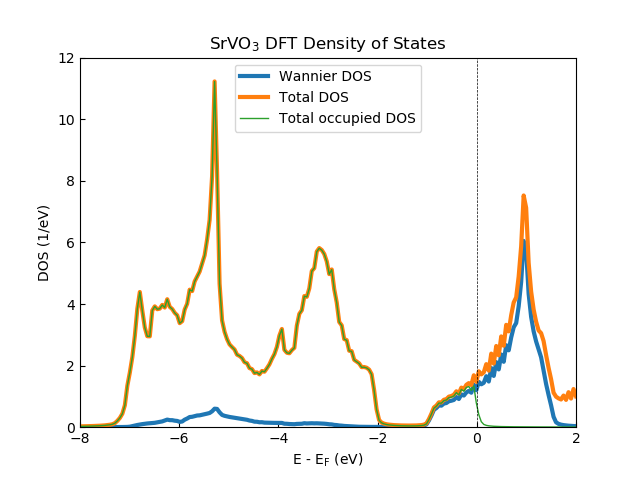
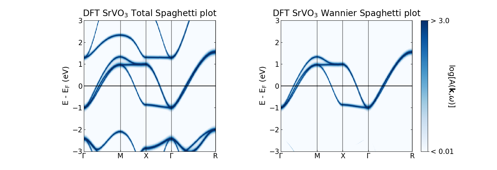
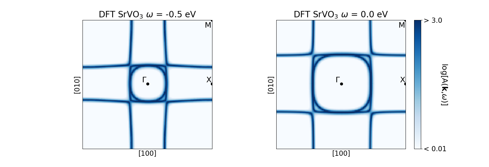

.. _analysis:

Tools for analysis
==================

This section explains how to use some tools of the package in order to analyse the data. There are certain tools here which are not available for some DFT code interfaces. Please refer to the DFT package interface converter documentation (see :ref:`conversion`) on how to interface the required DFT outputs into the HDF5 files needed for the tools discussed here. This section will assume that the user has converted the required DFT data.

The following routines require a self energy on the real frequency axis if the user specifies the inputs `with_Sigma` and `with_dc`: 

  * :meth:`density_of_states <dft.sumk_dft_tools.SumkDFTTools.density_of_states>` for the momentum-integrated spectral function including self energy effects and
  * :meth:`spaghettis <dft.sumk_dft_tools.SumkDFTTools.spaghettis>` for the momentum-resolved spectral function (i.e. ARPES)
  * :meth:`spectral_contours <dft.sumk_dft_tools.SumkDFTTools.spectral_contours>` for the k-resolved spectral function on a specific k-mesh (i.e., spectral function on a two dimensional k-mesh)

.. note::
  This package does NOT provide an explicit method to do an **analytic continuation** of
  self energies and Green functions from Matsubara frequencies to the real-frequency axis,
  but a list of options available within the TRIQS framework is given :ref:`here <ac>`.
  Keep in mind that all these methods have to be used very carefully!

Otherwise, without these options, the spectral functions from the inputs of the interfaced DFT code will be used. 

The other routines presented here use the Matsubara self-energy.

Initialisation
--------------

All tools described below are collected in an extension of the :class:`SumkDFT <dft.sumk_dft.SumkDFT>` class and are
loaded by importing the module :class:`SumkDFTTools <dft.sumk_dft_tools.SumkDFTTools>`::

  from triqs_dft_tools.sumk_dft_tools import *

The initialisation of the class is equivalent to that of the :class:`SumkDFT <dft.sumk_dft.SumkDFT>`
class::

  SK = SumkDFTTools(hdf_file = filename + '.h5')

Note that all routines available in :class:`SumkDFT <dft.sumk_dft.SumkDFT>` are also available here.

If required, we have to load and initialise the real-frequency self energy. Most conveniently,
you have your self energy already stored as a real-frequency :class:`BlockGf <triqs.gf.BlockGf>` object
in a hdf5 file::

  with HDFArchive('case.h5', 'r') as ar:
        SigmaReFreq = ar['dmft_output']['Sigma_w']

You may also have your self energy stored in text files. For this case the :ref:`TRIQS <triqslibs:welcome>` library offers
the function :meth:`read_gf_from_txt`, which is able to load the data from text files of one Green function block
into a real-frequency :class:`ReFreqGf <triqs.gf.ReFreqGf>` object. Loading each block separately and
building up a :class:´BlockGf <triqs.gf.BlockGf>´ is done with::

  from triqs.gf.tools import *
  # get block names
  n_list = [n for n,nl in SK.gf_struct_solver[0].iteritems()]
  # load sigma for each block - in this example sigma is composed of 1x1 blocks
  g_blocks = [read_gf_from_txt(block_txtfiles=[['Sigma_'+name+'.dat']], block_name=n) for n in n_list]
  # put the data into a BlockGf object
  SigmaReFreq = BlockGf(name_list=n_list, block_list=g_blocks, make_copies=False)

where:
 
  * `block_txtfiles` is a rank 2 square np.array(str) or list[list[str]] holding the file names of one block and
  * `block_name` is the name of the block.

It is important that each data file has to contain three columns: the real-frequency mesh, the real part and the imaginary part
of the self energy - exactly in this order! The mesh should be the same for all files read in and non-uniform meshes are not supported.

Finally, we set the self energy into the `SK` object::

    SK.set_Sigma([SigmaReFreq])

and additionally set the chemical potential and the double counting correction from the DMFT calculation::

  chemical_potential, dc_imp, dc_energ = SK.load(['chemical_potential','dc_imp','dc_energ'])
  SK.set_mu(chemical_potential)
  SK.set_dc(dc_imp,dc_energ)

Density of states
-----------------

For plotting the density of states, you type::

  SK.density_of_states(mu, broadening, mesh, with_Sigma, with_dc, proj_type, dosocc, save_to_file)

where a description of all of the inputs are given in :meth:`density_of_states <dft.sumk_dft_tools.SumkDFTTools.density_of_states>`:

.. automethod:: triqs_dft_tools.sumk_dft_tools.SumkDFTTools.density_of_states
  :noindex: 

The figure above shows the DFT SrVO\ :sub:`3`\  density of states generated from 2925 k-points in the irreducible Brillouin zone with the V t\ :sub:`2g`\  Wannier projectors generated within a correlated energy window of [-13.6, 13.6] eV. The `broadening` input has been set to the temperature (i.e., 1/Beta). The total, V t\ :sub:`2g`\  Wannier and occupied total density of states generated from the SK.density_of_states() routine are shown. Note that the noise in the density of states comes from the number of k-points used. This can be removed upon by either using more k-points or using a larger `broadening` value.

Band resolved density matrices
------------------------------

Calculates the band resolved density matrices (occupations) from the Matsubara frequency self-energy.
This is done by calling the following::

  SK.occupations(mu, with_Sigma, with_dc, save_occ):

This is required to generate the occupied DOS in SK.density_of_states() when dosocc is set to True. The `save_occ` optional input (True by default) saves these density matrices to the HDF5 file within the misc_data subgroup. The other variables are the same as defined above. See :meth:`occupations <dft.sumk_dft_tools.SumkDFTTools.occupations>`

Momentum resolved spectral function (with real-frequency self energy)
---------------------------------------------------------------------

Another quantity of interest is the calculated momentum-resolved spectral function A(k, :math:`\omega`) or (correlated) band structure which can directly be compared to ARPES experiments. 
First we have generate the required files from the DFT code of choice and interface them with DFT_Tools, see the guides of the DFT converters (:ref:`conversion`) on how to do this.

This spectral function is calculated by typing::

  SK.spaghettis(mu, broadening, mesh, plot_shift, plot_range, shell_list, with_Sigma, with_dc, proj_type, save_to_file)

.. automethod:: triqs_dft_tools.sumk_dft_tools.SumkDFTTools.spaghettis
  :noindex: 

The figure above shows the DFT SrVO\ :sub:`3`\  spaghetti plot (generated using V t\ :sub:`2g`\  Wannier projectors generated within a correlated energy window of [-13.6, 13.6] eV). As before, the broadening input has been set to the temperature (i.e., 1/Beta). The left panel shows the total A(k, :math:`\omega`) whereas the right gives the Wannier A(k, :math:`\omega`), both generated from this SK.spaghettis().

Energy contours of the k-resolved Spectral function
---------------------------------------------------

Currently, this has only been implemented for Elk DFT inputs only.

This routine calculates the k-resolved spectral function evaluated at the Fermi level or several energy contours on the k-mesh defined in the converter stage::

  SK.spectral_contours(mu, broadening, mesh, plot_range, FS, with_Sigma, with_dc, proj_type, save_to_file)

.. automethod:: triqs_dft_tools.sumk_dft_tools.SumkDFTTools.spectral_contours
  :noindex: 

The figure above shows the DFT SrVO\ :sub:`3`\  energy contour plots (again, generated using V t\ :sub:`2g`\  Wannier projectors generated within a correlated energy window of [-13.6, 13,6] eV and broadening of 1/Beta). Both panels have been generated on a k-mesh within the first Brillouin zone on the k\ :sub:`z`\ = 0.0 plane centered at the :math:`\Gamma` point. Here, each panel generated using the outputs from this SK.spectral_contours_plot() routine shows the A(k, :math:`\omega`) evaluated at :math:`\omega` = -0.5 eV (left) and the Fermi level, :math:`\omega` = 0.0 eV, (right).

Partial charges
---------------

Currently, this has only been implemented for Wien2k DFT inputs only.

Since we can calculate the partial charges directly from the Matsubara Green functions, we also do not need a
real-frequency self energy for this purpose. The calculation is done by::

  SK.set_Sigma(SigmaImFreq)
  dm = SK.partial_charges(beta=40.0, with_Sigma=True, with_dc=True)

which calculates the partial charges using the self energy, double counting, and chemical potential as set in the 
`SK` object. On return, `dm` is a list, where the list items correspond to the density matrices of all shells
defined in the list `SK.shells`. This list is constructed by the Wien2k converter routines and stored automatically
in the hdf5 archive. For the structure of `dm`, see also :meth:`partial charges <dft.sumk_dft_tools.SumkDFTTools.partial_charges>`.

