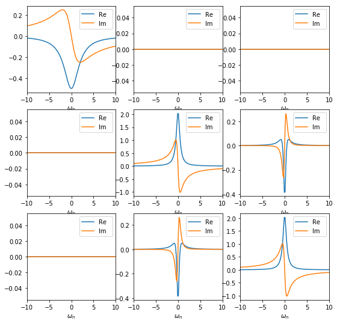
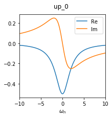
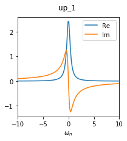

.. _blockstructure:

Manipulating the Green's functions block structure
==================================================

The DFTTools package includes the general :class:`BlockStructure <dft.block_structure.BlockStructure>` class for manipulating the blocks of Green's functions (see also the TRIQS documentation on BlockGF). In the following, we will introduce its basic and most commonly used functionalities that might show up in an actual DFT+DMFT calculation, and will illustrate them on a very basic fictitious problem.

The main idea is to have two structures for the Greens functions available. The first one is used in the procedures of the :class:`SumkDFT <dft.sumk_dft.SumkDFT>` to calculate Dysons equations, lattice Greens functions, and so on, and is normally a full matrix. For instance, in a calculation using :math:`t_{2g}` orbitals without spin-orbit-coupling, you have an spin-up block of size 3x3 and a spin-down block of the same size. In the following, wee will refer to this structure as *sumk* structure. 

The second structure, called *solver* structure, is the one which is used for the solution of the Anderson impurity problem. As a matter of fact, in particular in combination with quantum Monte Carlo techniques, it is advisable to use as small blocks as possible in order to run into numerical problems. In particular, it should contain information about the symmetry of the local problem.

Creating a block structure and Green's function
-----------------------------------------------

For the purpose of this documentation, we focus on an example of a 3x3 Green's function, consisting of a 1x1 block and a 2x2 block (with off-diagonal coupling). This is reminiscent of a :math:`t_{2g}` manifold. Note that this initialisation is normally done automatically by DFTTools, we do it here manually for demonstration purposes only.

We can create a simple :class:`BlockStructure <dft.block_structure.BlockStructure>` object as follows::
    
    from triqs_dft_tools import BlockStructure
    BS = BlockStructure.full_structure([{'up':[0,1,2]}], None)

This creates a block structure with one 3x3 block named *up*. Note that we have not created any Green's function yet; this is just the structure of those objects. If you want to create a Green's function with this structure, you can do (we will if with some content also)::

    from triqs.gf import *
    GF_sumk = BS.create_gf(space='sumk', beta = 40, n_points = 1000)
    GF_sumk['up'][0,0] << iOmega_n - 2.0
    GF_sumk['up'][1,1] << iOmega_n + 0.5
    GF_sumk['up'][2,2] << iOmega_n + 0.5
    GF_sumk['up'][1,2] << 0.1
    GF_sumk['up'][2,1] << 0.1
    GF_sumk['up'] << inverse(GF_sumk['up'])

Technically, we use the *sumk* block structure for this Green's function. However, at this point, sumk and solver structure are still the same.

A plot of this structure looks like this. Note that there are off-diagonal elements which are exactly zero by construction.

The *solver* structure
----------------------

The method:`BlockStructure.full_structure()` method, as we used it above to create our BlockStructure object, yields - as the name suggests - a full structure, where *sumk* and *solver* structure are identical. Now we want to take advantage of the symmetries of the problem to reduce the *solver* block structure to the relevant matrix elements only. In our case the [0,0] matrix element of the Green's function is completely decoupled from the 2x2 matrix of [1:2,1:2] elements. We simplify the *solver* structure by setting the mapping of each orbital to its target block and orbital::

    BS.map_gf_struct_solver([{('up',0):('up_0',0), ('up',1):('up_1',0), ('up',2):('up_1',1)}])

This creates a *solver* structure different from the *sumk* structure. To see the result, let us look at the Green's function in the *solver* structure now::

    GF_solver = BS.convert_gf(GF_sumk, space_from='sumk', space_to='solver')

This converts the GF_sumk into GF_solver, which looks like this.

.. image:: images_scripts/BS_GF_up_1.png
    :width: 400
    :align: center

As you can see, the Green's function in the *solver* structure now consists of two blocks: one 1x1 block (called *up_0*) and one 2x2 block (called *up_1*). This is no approximation, as the off-diagonal elements between these blocks are exactly zero anyway.

Picking orbitals
----------------

In some cases it might happen that for the projection to localised orbitals a full *d* or *f*-shell has to be used. However, for the Anderson impurity problem, just a subset of the orbitals are needed. This is the case, e.g., when the projection leads to completely empty or full orbitals that you don't want to include in the AIM. 

For the example here, the local energy of the *up_0* block (2 eV) is higher than that of the *up_1* block (0.4 and 0.6 eV). Assuming that the chemical potential lies somewhere in the range of the *up_1* block, we might restrict our calculation to only this *up_1* block. The :class:`BlockStructure <dft.block_structure.BlockStructure>` class includes methods to pick a subset or orbitals::

    BS.pick_gf_struct_solver([{'up_1':[0,1]}])
    GF2 = BS.convert_gf(GF_sumk, space_from='sumk', space_to='solver')

Now the Green's function GF2 consists of only one 2x2 block, called *up_1*, as we have left out the *up_0* block.

Basis rotations
---------------

In cases where the Greens function or the local Hamiltonian shows off diagonal entries in the chosen basis, it is often beneficial to rotate to a different basis. This is of particular interest when using a QMC solver, since off-diagonal contributions lead to a famous fermionic sign problem. The :class:`BlockStructure <dft.block_structure.BlockStructure>` class includes methods to perform such basis rotations.

In our example, the local Hamiltonian is given by

.. math::

    \varepsilon_{mm'} = \begin{pmatrix} 2.0 & 0.0 & 0.0 \\0.0  & -0.5 & -0.1\\0.0 & -0.1 & -0.5 \end{pmatrix}

It is easy to check that the following matrix diagonalises this local Hamiltonian:

.. math::

    T_{mm'} = \begin{pmatrix} 1.0 & 0.0 & 0.0 \\0.0  & 1/\sqrt{2} & -1/\sqrt{2}\\0.0 & 1/\sqrt{2} & 1/\sqrt{2} \end{pmatrix}

With this unitary matrix, we can do a basis rotation to reduce the size of the off-diagonal matrix elements. Note that the transformation matrix has to be given in the *sumk* basis form (a 3x3 matrix in this case)::

    import numpy as np
    # Unitary transformation matrix
    T = np.array([[1,0,0],[0,1./np.sqrt(2),-1./np.sqrt(2)],[0,1./np.sqrt(2),1./np.sqrt(2)]])

    BS.transformation = [T]
    GF3 = BS.convert_gf(GF_sumk, space_from='sumk', space_to='solver')

.. image:: images_scripts/BS_GF_up_1_rotated.png
    :width: 400
    :align: center

As you can see, the offdiagonal elements are reduced to 1e-16 in this basis. Please note that our example is not the most generic case. Normally, due to non-local hybridisation, the off-diagonals can be made smaller, but not exactly zero.

Diagonal approximation
----------------------

As said above, off diagonal contributions lead to some troubles. However,
when you are exactly sure that you know what you are doing, there is functionality to take only the diagonal parts into account in the block structure. Be careful, there is no automatic check whether this approximation is justified or not!

Starting from the rotated basis as done above, we can get rid of the off-diagonals as follows::

    BS.approximate_as_diagonal()
    GF4 = BS.convert_gf(GF_sumk, space_from='sumk', space_to='solver')

The Green's function GF4 consists now only of two 1x1 blocks, where *up_1* was the [0,0] element of the former 2x2 block, and *up_2* was the [1,1] element:

.. image:: images_scripts/BS_GF_up_2_rotated_diag.png
    :width: 200
    :align: center

In summary, we started with a full 3x3 matrix in the very beginning, and ended with two 1x1 blocks containing the relevant matrix elements for the calculation.

  
