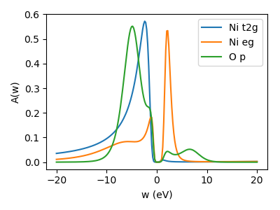

.. _nio_csc:

DFT and projections
==================================================

We will perform DFT+DMFT calcluations for the charge-transfer insulator NiO. We start from scratch and provide all necessary input files to do the calculations: First for doing a single-shot calculation.
.. (and then for charge-selfconsistency).

VASP setup
-------------------------------
We start by running a simple VASP calculation to converge the charge density initially.
Use the :ref:`INCAR`, :ref:`POSCAR`, and :ref:`KPOINTS` provided and use your
own :file:`POTCAR` file.

Let us take a look in the :file:`INCAR`, where we have to specify local orbitals as basis
for our many-body calculation.

.. literalinclude:: images_scripts/INCAR

`LORBIT = 14` takes care of optimizing the projectors in the energy window defined
by `EMIN` and `EMAX`. We switch off all symmetries with `ISYM=-1` since symmetries
are not implemented in the later DMFT scripts. Finally, we select the relevant orbitals
for atom 1 (Ni, d-orbitals) and 2 (O, p-orbitals) by the two `LOCPROJ` lines.
For details refer to the VASP wiki on the `LOCPROJ <https://cms.mpi.univi
e.ac.at/wiki/index.php/LOCPROJ>`_ flag. The projectors are stored in the file `LOCPROJ`.

PLOVASP
------------------------------
Next, we postprocess the projectors, which VASP stored in the file `LOCPROJ`.
We do this by invoking :program:`plovasp plo.cfg` which is configured by an input file, e.g., named :ref:`plo.cfg`.

.. literalinclude:: images_scripts/plo.cfg

Here, in `[General]` we set the basename and the grid for calculating the density of
states. In `[Group 1]` we define a group of two shells which are orthonormalized with
respect to states in an energy window from `-9` to `2` for all ions simultanously
(`NORMION = False`). We define the two shells, which correspond to the Ni d states
and the O p states. Only the Ni shell is treated as correlated (`CORR = True`), i.e.,
is supplemented with a Coulomb interaction later in the DMFT calculation.

Converting to hdf5 file
-------------------------------
We gather the output generated by :program:`plovasp` into a hdf5 archive which :program:`dft_tools` is able to read. We do this by running :program:`python converter.py` on the script :ref:`converter.py`:

.. literalinclude:: images_scripts/converter.py

Now we are all set to perform a dmft calculation.

DMFT
==================================================

dmft script
------------------------------

Since the python script for performing the dmft loop pretty much resembles that presented in the tutorial on :ref:`SrVO3 <srvo3>`, we will not go into detail here but simply provide the script :ref:`nio.py`. Following Kunes et al. in `PRB 75 165115 (2007) <https://journals.aps.org/prb/abstract/10.1103/PhysRevB.75.165115>`_ we use :math:`U=8` and :math:`J=1`. We select :math:`\beta=5` instead of :math:`\beta=10` to ease the problem slightly. For simplicity we fix the double-counting potential to :math:`\mu_{DC}=59` eV by::

  DC_value = 59.0
  SK.calc_dc(dm, U_interact=U, J_hund=J, orb=0, use_dc_value=DC_value)

For sensible results run this script in parallel on at least 20 cores. As a quick check of the results, we can compare the orbital occupation from the paper cited above (:math:`n_{eg} = 0.54` and :math:`n_{t2g}=1.0`) and those from the cthyb output (check lines `Orbital up_0 density:` for a t2g  and `Orbital up_2 density:` for an eg orbital). They should coincide well.

Local lattice Green's function for all projected orbitals
---------------------------------------------------------
We calculate the local lattice Green's function - now also for the uncorrelated orbitals, i.e., the O p states, for what we use the script :ref:`NiO_local_lattice_GF.py`. The result is saved in the h5 file as `G_latt_orb_it<n_it>`, where `<n_it>` is the number of the last DMFT iteration.

Spectral function on real axis: MaxEnt
--------------------------------------
To compare to results from literature we make use of the `maxent triqs application <https://triqs.github.io/maxent/master/>`_ and calculate the spectral function on real axis. Use this script to perform a crude but quick calculation: :ref:`maxent.py` using a linear real axis and a line-fit analyzer to determine the optimal :math:`\alpha`. The output is saved in the h5 file in `DMFT_results/Iterations/G_latt_orb_w_o<n_o>_it<n_it>`, where `<n_o>` is the number of the orbital and `n_it` is again the number of the last iteration. The real axis information is stored in `DMFT_results/Iterations/w_it<n_it>`.

Charge self-consistent DMFT
==================================================

In this part we will perform charge self-consistent DMFT calculations. To do so we have to adapt the VASP `INCAR` such that :program:`VASP` reads the updated charge density after each step. We add the lines::

  ICHARG = 5
  NELM = 1000
  NELMIN = 1000
  IMIX=0

which makes VASP wait after each step of its iterative diagonalization until the file vasp.lock is created. It then reads the update of the charge density in the file `GAMMA`. It is terminated by an external script after a desired amount of steps, such that we deactivate all automatic stoping criterion by setting the number of steps to a very high number.

We take the respective converged DFT and DMFT calculations from before as a starting point. I.e., we copy the `CHGCAR` and `nio.h5` together with the other :program:`VASP` input files and :file:`plo.cfg` in a new directory. We use a script called :program:`vasp_dmft` to invoke :program:`VASP` in the background and start the DMFT calculation together with :program:`plovasp` and the converter. This script assumes that the dmft sript contains a function `dmft_cycle()` and also the conversion from text files to the h5 file. Additionally we have to add a few lines to calculate the density correction and calculate the correlation energy. We adapt the script straightforardly (for a working example see :ref:`nio_csc.py`). The most important new lines are::

  SK.chemical_potential = SK.calc_mu( precision = 0.000001 )
  SK.calc_density_correction(dm_type='vasp')
  correnerg = 0.5 * (S.G_iw * S.Sigma_iw).total_density()

where the chemical potential is determined to a greater precision than before, the correction to the dft density matrix is calculated and output to the file :file:`GAMMA`. The correlation energy is calculated via Migdal-Galitzki formula. We also slightly increase the tolerance for the detection of blocks since the DFT calculation now includes some QMC noise.

To help convergence, we keep the density (i.e., the GAMMA file) fixed for a few DFT iterations. We do so since VASP uses an iterative diagonalization.

We can start the whole machinery by excecuting::

  vasp_dmft -n <n_procs> -i <n_iters> -j <n_iters_dft> -p <vasp_exec>  nio_csc.py
