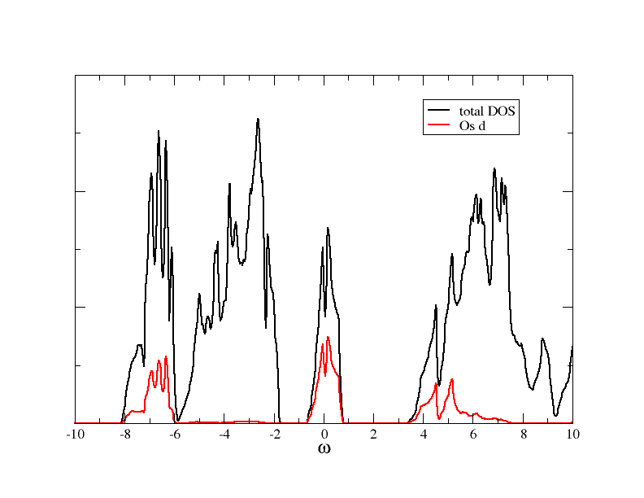

.. _Sr2MgOsO6_noSOC:

Here we will discuss a calculation where off-diagonal matrix elements show up, and will discuss step-by-step how this calculation can be set up.

The full script for this calculation is also provided here (:download:`Sr2MgOsO6_noSOC.py <images_scripts/Sr2MgOsO6_noSOC.py>`).

Note that we do not include spin-orbit coupling here for pedagogical reasons. For the real material it is necessary to include also SOC.

DFT (Wien2k) and Wannier orbitals
=================================

DFT setup
---------

First, we do a DFT calculation, using the Wien2k package. As main input file we have to provide the so-called struct file :file:`Sr2MgOs6_noSOC.struct`. We use the following:

.. literalinclude:: images_scripts/Sr2MgOsO6_noSOC.struct

The DFT calculation is done as usual, for instance you can use for the initialisation

   init -b -vxc 5 -numk 2000 

This is setting up a non-magnetic calculation, using the LDA and 2000 k-points in the full Brillouin zone. As usual, we start the DFT self consistent cycle by the Wien2k script ::

  run

After the SC cycled finished, you can calculate the DOS. It should look like what you can see in this figure:

Wannier orbitals
----------------

As a next step, we calculate localised orbitals for the d orbitals. We use this input file for :program:`dmftproj`:

.. literalinclude:: images_scripts/Sr2MgOsO6_noSOC.indmftpr

Note that, due to the distortions in the crystal structure, we need to include all five d orbitals in the calculation (line 8 in the input file above). The projection window is set such that all d orbitals are included.

To prepare the input data for :program:`dmftproj` we execute lapw2 with the `-almd` option ::
   
   x lapw2 -almd 

Then  :program:`dmftproj` is executed in its default mode (i.e. without spin-polarization or spin-orbit included) ::

   dmftproj 

At the end of the run you see the density matrix in Wannier space:

.. literalinclude:: images_scripts/Sr2MgOsO6_noSOC.outdmftpr

As you can see, there are off-diagonal elements between the :math:`d_{x^2-y^2}` and the :math:`d_{xy}` orbital.

We convert the output to the hdf5 archive, using 
the python module :class:`Wien2kConverter <dft.converters.wien2k.Wien2kConverter>`. A simple python script doing this is::

  from triqs_dft_tools.converters.wien2k import *
  Converter = Wien2kConverter(filename = "Sr2MgOsO6_noSOC")
  Converter.convert_dft_input()

This reads all the data, and stores everything that is necessary for the DMFT calculation in the file :file:`Sr2MgOsO6_noSOC.h5`.

The DMFT calculation
====================

Rotating the basis
------------------

Before starting the DMFT calculation it is beneficial to look a bit more closely at the block structure of the problem. Eventually, we want to use a basis that is as diagonal as possible, and include only the partially filled orbitals in the correlated problem. All this can be done using the functionalities of the :class:`BlockStructure <dft.block_structure.BlockStructure>` class, see section :ref:`blockstructure`.

We first initialise the SumK class::

    from triqs_dft_tools.sumk_dft import *
    SK = SumkDFT(hdf_file='Sr2MgOsO6_noSOC.h5',use_dft_blocks=True)

The flag *use_dft_blocks=True* determines, as usual, the smallest possible blocks with non-zero entries, and initialises them as *solver* block structure. In order to disentangle the :math:`d_{x^2-y^2}` and the :math:`d_{xy}` orbitals, and pick out only the partially filled one, we do a transformation into a basis where the local Hamiltonian is diagonal::

    mat = SK.calculate_diagonalization_matrix(prop_to_be_diagonal='eal',calc_in_solver_blocks=True)

We can look at the diagonalisation matrix, it is::

    >>> print mat[0]['down']
    [[ 1.   +0.j     0.   +0.j     0.   +0.j     0.   +0.j     0.   +0.j   ]
     [ 0.   +0.j    -0.985+0.j     0.   -0.173j  0.   +0.j     0.   +0.j   ]
     [ 0.   +0.j     0.173+0.j     0.   -0.985j  0.   +0.j     0.   +0.j   ]
     [ 0.   +0.j     0.   +0.j     0.   +0.j     1.   +0.j     0.   +0.j   ]
     [ 0.   +0.j     0.   +0.j     0.   +0.j     0.   +0.j     1.   +0.j   ]]
    >>> 

This transformation is already stored in the SK.block_structure class. The next step is actually not needed for a DMFT calculation, but it is good to do this check to see what the transformation does to the local Hamiltonian. We can calculate it before rotation, rotate it, and look at the 2x2 block with and without off-diagonals::

    eal  = SK.eff_atomic_levels()
    eal2 = SK.block_structure.convert_matrix(eal[0],space_from='sumk', space_to='solver')

    print eal[0]['up'][1:3,1:3]                # prints the 2x2 block with offiagonals
    [[ 0.391+0.j    -0.   -0.815j]
     [-0.   +0.815j  4.884-0.j   ]]

    print eal2['up_1']                         # prints the 2x2 block after rotation
    [[0.247-0.j 0.   +0.j]
     [0.   -0.j 5.028+0.j]]

So the local Hamiltonian has been diagonalised. From the other entries we can see that the *up_0* block and the [1,1] entry of the *up_1* block correspond to :math:`e_g`-like orbitals, and the others are the 
:math:`t_{2g}` orbitals that we want to keep. So we pick the according orbitals in the block structure::

    SK.block_structure.pick_gf_struct_solver([{'up_1': [0],'up_2': [0],'up_3': [0],'down_1': [0],'down_2': [0],'down_3': [0]}])

We can now look at the final result::

    print SK.block_structure.convert_matrix(eal[0],space_from='sumk',space_to='solver')
    {'up_2': array([[0.156-0.j]]), 'up_3': array([[0.156-0.j]]), 'up_1': array([[0.247-0.j]]), 'down_3': array([[0.156-0.j]]), 'down_2': array([[0.156-0.j]]), 'down_1': array([[0.247-0.j]])}

We see that we arrived at a structure with 3 orbitals per spin only, and blocks of size 1x1.

The interaction Hamiltonian
---------------------------

We now set up the interaction Hamiltonian. Since we want to rotate the interaction matrix into the local basis, we are using the Slater convention for it:: 

    from triqs.operators.util import *
    from triqs.operators.util.U_matrix import *

    U = 2.0
    J = 0.2
    U_mat = U_matrix(l=2,U_int=U,J_hund=J,basis='other', T=SK.T[0].conjugate())

In the last line we use the Wien2k convention to write the U matrix in the cubic harmonics. Next, we want to set up a Hamiltonian and rotate it into the *solver* basis::

    h_sumk = h_int_slater(['up','down'], range(5), U_mat,  off_diag=True)
    h_int = SK.block_structure.convert_operator(h_sumk)
    h_int = h_int.real

Note that we needed to set up the interaction Hamiltonian for the full set of five *d* orbitals. The :meth:`convert_operator` method then takes care of rotating and picking the relevant orbitals. In the last line above we made the Hamiltonian real, since we know it this case that there are only real numbers in the interaction Hamiltonian. Note that this is not generally the case!

Now we have the interaction Hamiltonian for the solver, which we set up next::

    from triqs_cthyb import *
    import triqs.utility.mpi as mpi

    beta = 40.0
    S = Solver(beta=beta, gf_struct=SK.block_structure.gf_struct_solver_list[0])

    # Solver parameters:
    p = {}
    # solver
    p["random_seed"] = 123 * mpi.rank + 567
    p["length_cycle"] = 200
    p["n_warmup_cycles"] = 100000
    p["n_cycles"] = 1000000
    # tail fit
    p["perform_tail_fit"] = True
    p["fit_max_moment"] = 4
    p["fit_min_n"] = 40
    p["fit_max_n"] = 100

The DMFT loop with automatic basis rotations
--------------------------------------------

After these initialisation steps, the formal DMFT cycle is very similar to a calculation without these basis rotations, since these rotations are done automatically, once the :class:`BlockStructure` property *transformation* is set, see :ref:`basisrotation`.

The DMFT loop itself looks very much the same as in :ref:`SrVO3`::

    # double counting correction:
    dc_type = 0  # FLL
    # DMFT loops:
    n_loops = 1

    for iteration_number in range(1,n_loops+1):

        mpi.report("Iteration = %s"%iteration_number)

        SK.symm_deg_gf(S.Sigma_iw)                      # symmetrizing Sigma
        SK.set_Sigma([ S.Sigma_iw ])                    # put Sigma into the SumK class
    	chemical_potential = SK.calc_mu( precision = 0.01 )  # find the chemical potential for given density
    	S.G_iw << SK.extract_G_loc()[0]

    	if (iteration_number==1):
            # Put Hartree energy on Re Sigma
            dm = S.G_iw.density()
            SK.calc_dc(dm, U_interact = U, J_hund = J, orb = 0, use_dc_formula = dc_type)
            S.Sigma_iw << SK.block_structure.convert_matrix(SK.dc_imp[0],space_from='sumk',space_to='solver')['up_1'][0,0]

        # Calculate new G0_iw to input into the solver:
        S.G0_iw << S.Sigma_iw + inverse(S.G_iw)
        S.G0_iw << inverse(S.G0_iw)

        # Solve the impurity problem:
        S.solve(h_int=h_int, **p)

        # Solved. Now do post-solution stuff:
        # Set the new double counting:
        dm = S.G_iw.density() # compute the density matrix of the impurity problem
        SK.calc_dc(dm, U_interact = U, J_hund = J, orb = 0, use_dc_formula = dc_type)

        # Save stuff into the user_data group of hdf5 archive in case of rerun:
        SK.save(['chemical_potential','dc_imp','dc_energ'])

The only difference to the other example is in the initialisation of the real part of the self energy. We cannot just take an element of the *dc_imp* array, since this array is stored in the *sumk* structure. Therefore, we first need to transform this matrix into *solver* space, and then take the appropriate matrix element. After the first iteration (here done with 24e6 MC sweeps and using the real version of the CTMQC solver), you should get self energies like this:

.. image:: images_scripts/Sr2MgOsO6_noSOC_Sigmas.png
    :width: 600
    :align: center

The two :math:`d_{xz}` and :math:`d_{yz}` orbitals are degenerate (blocks *up_2* and *up_3*), whereas the :math:`d_{xy}`-like orbital is different.

A complete python script for this tutorial, including some more input/output, is available (:download:`Sr2MgOsO6_noSOC.py <images_scripts/Sr2MgOsO6_noSOC.py>`). When running the script, you will encounter warnings during the transformation from the *sumk* to the *solver* basis. These warnings just reflect that the off-diagonal elements of the full Greens function are not zero at all frequencies, although the local Hamiltonian is. In that sense, we still do an approximation when restricting ourselves to the :math:`t_{2g}`-like orbitals.