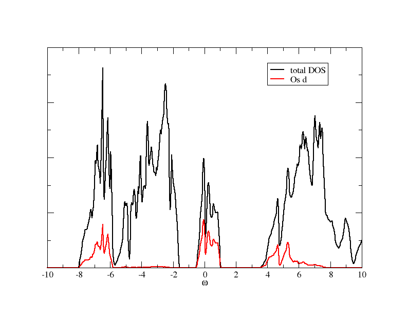

.. _Sr2MgOsO6_SOC:

In this tutorial we will discuss how to set up and perform a calculation including spin-orbit coupling. As an example, we again take Sr2MgOsO6, as we used for the discussion of basis rotations (:ref:`Sr2MgOsO6_noSOC`).

The full script for this calculation is also provided here (:download:`Sr2MgOsO6_SOC.py <images_scripts/Sr2MgOsO6_SOC.py>`).

DFT (Wien2k) and Wannier orbitals
=================================

DFT setup
---------

First, we do the DFT calculation, using the Wien2k package. As main input file we have to provide the struct file :file:`Sr2MgOs6_noSOC.struct`:

.. literalinclude:: images_scripts/Sr2MgOsO6_noSOC.struct

The struct file is the same as for non SOC calculations. However, the DFT calculation is done a bit differently now. First, we need to do a spin-polarised DFT calculation, but with magnetic moment set to zero. In the Wien2k initialisation procedure, one can choose for the option -nom when ``lstart`` is called. This means that the charge densities are initialised without magnetic splitting. After initialisation, do a full SC DFT run::

    runsp 

After this SC cycled finished, we continue with the spin-orbit calculation. We initialise it with the Wien2k command::

    init_so

In this initialisation procedure, be sure to select a spin-polarised calculation. Then the SC cycle including SOC is done by::

    runsp -so

After the SC cycled finished, you can calculate the DOS with SOC iuncluded. It should look like what you can see in this figure:

Wannier orbitals
----------------

As a next step, we calculate localised orbitals for the d orbitals. We use this input file for :program:`dmftproj`:

.. literalinclude:: images_scripts/Sr2MgOsO6_SOC.indmftpr

Note that, due to the distortions in the crystal structure and the SOC, we include all five d orbitals in the calculation (line 8 in the input file above). The projection window is set such that all d orbitals are included.

To prepare the input data for :program:`dmftproj` we execute lapw2 with the following options::
   
   x lapw2 -up -c -so -almd 
   x lapw2 -dn -c -so -almd

Then  :program:`dmftproj` is executed for SOC::

   dmftproj -sp -so

At the end of the run you see the density matrix in Wannier space:

.. literalinclude:: images_scripts/Sr2MgOsO6_SOC.outdmftpr

As you can see, there are a lot of off-diagonal elements now, in particular also off-diagonal in spin space. This is just telling us that spin is not a good quantum number any more in the presence of SOC.

We convert the output to the hdf5 archive, using 
the python module :class:`Wien2kConverter <dft.converters.wien2k.Wien2kConverter>`. A simple python script doing this is::

  from triqs_dft_tools.converters.wien2k import *
  Converter = Wien2kConverter(filename = "Sr2MgOsO6_SOC")
  Converter.convert_dft_input()

This reads all the data, and stores everything that is necessary for the DMFT calculation in the file :file:`Sr2MgOsO6_SOC.h5`.

The DMFT calculation
====================

Rotating the basis
------------------

Before starting the DMFT calculation it is beneficial to look a bit more closely at the block structure of the problem. Eventually, we want to use a basis that is as diagonal as possible, and include only the partially filled orbitals in the correlated problem. All this can be done using the functionalities of the :class:`BlockStructure <dft.block_structure.BlockStructure>` class, see section :ref:`blockstructure`.

We first initialise the SumK class::

    from triqs_dft_tools.sumk_dft import *
    SK = SumkDFT(hdf_file='Sr2MgOsO6_SOC.h5',use_dft_blocks=True)

The flag *use_dft_blocks=True* determines, as usual, the smallest possible blocks with non-zero entries, and initialises them as *solver* block structure. We want to work in the basis that diagonalises the local Hamiltonian, which is often referred to as numerical j-basis. The transformation into this basis is calculated by::

    mat = SK.calculate_diagonalization_matrix(prop_to_be_diagonal='eal',calc_in_solver_blocks=True)

This transformation is stored in the SK.block_structure class and can be used to transform Greens function or operators. The next step is actually not needed for a DMFT calculation, but it is good to do this check to see what the transformation does to the local Hamiltonian. Note that in case of SOC, although spin is not a good quantum number any more, there are two blocks of size 5x5, each corresponding to negative/positive :math:`m_j` values::

    eal  = SK.eff_atomic_levels()
    eal2 = SK.block_structure.convert_matrix(eal[0],space_from='sumk', space_to='solver')

    print eal2['ud_0'].diagonal().real.   # diagonal of the first 5x5 block
    [0.071 0.131 0.608 4.572 5.128]

    print eal2['ud_1'].diagonal().real.   # diagonal of the second 5x5 block
    [0.071 0.131 0.608 4.572 5.128]

We see that the orbitals are ordered from low to high energy, which makes picking the orbitals around the Fermi level quite easy. We just take indices 0 to 2::

    SK.block_structure.pick_gf_struct_solver([{'ud_0': [0,1,2],'ud_1': [0,1,2]}])

We can now look at the final result::

    eal3 = SK.block_structure.convert_matrix(eal[0],space_from='sumk', space_to='solver')
    
    print eal3['ud_0']
    [[ 0.071+0.j  0.   +0.j -0.   -0.j]
     [-0.   -0.j  0.131+0.j -0.   -0.j]
     [-0.   +0.j  0.   +0.j  0.608-0.j]]
    
    print eal3['ud_1']
    [[ 0.071+0.j -0.   -0.j  0.   +0.j]
     [-0.   +0.j  0.131-0.j  0.   +0.j]
     [ 0.   -0.j  0.   -0.j  0.608+0.j]]
  
We see that we arrived at a diagonal structure with two blocks of size 3x3, and we have picked the orbitals around the Fermi level.

The interaction Hamiltonian
---------------------------

We now set up the interaction Hamiltonian. Since we want to rotate the interaction matrix into the local basis, we are using the Slater convention for it. We use *l=2* for *d* orbitals. Also, for SOC calculations, we need to inflate the resulting matrix to size 10x10:: 

    from triqs.operators.util import *
    from triqs.operators.util.U_matrix import *

    U = 2.0
    J = 0.2
    U_sph = U_matrix(l=2, U_int=U, J_hund=J)
    U_sph = np.kron(np.reshape(np.eye(2),(1,2,1,2)),np.kron(np.reshape(np.eye(2),(2,1,2,1)),U_sph))  # inflating the matrix
    U_mat = transform_U_matrix(U_sph, SK.T[0].conjugate())
    

In the last line we use the Wien2k convention to write the U matrix in the cubic harmonics. Next, we want to set up a Hamiltonian and rotate it into the *solver* basis::

    h_sumk = h_int_slater(['ud'], range(2*(2*l+1)), U_mat,  off_diag=True, complex=True)
    h_int = SK.block_structure.convert_operator(h_sumk)

Note that we needed to set up the interaction Hamiltonian first for the full set of *d* orbitals. The :meth:`convert_operator` method then takes care of rotating and picking the relevant orbitals.

Now we have the interaction Hamiltonian for the solver, which we set up next::

    from triqs_cthyb import *
    import triqs.utility.mpi as mpi

    beta = 40.0
    S = Solver(beta=beta, gf_struct=SK.block_structure.gf_struct_solver_list[0])

    # Solver parameters:
    p = {}
    # solver
    p["random_seed"] = 123 * mpi.rank + 567
    p["length_cycle"] = 200
    p["n_warmup_cycles"] = 100000
    p["n_cycles"] = 1000000
    # tail fit
    p["perform_tail_fit"] = True
    p["fit_max_moment"] = 4
    p["fit_min_w"] = 4.0
    p["fit_max_w"] = 8.0

The DMFT loop with automatic basis rotations
--------------------------------------------

After these initialisation steps, the formal DMFT cycle is very similar to a calculation without SOC, since the rotations are done automatically, once the :class:`BlockStructure` property *transformation* is set, see :ref:`basisrotation`.

The DMFT loop itself looks very much the same as in :ref:`SrVO3` or :ref:`Sr2MgOsO6_noSOC`::

    # double counting correction:
    dc_type = 0  # FLL
    # DMFT loops:
    n_loops = 1

    for iteration_number in range(1,n_loops+1):

        mpi.report("Iteration = %s"%iteration_number)

        SK.set_Sigma([ S.Sigma_iw ])                    # put Sigma into the SumK class
    	chemical_potential = SK.calc_mu( precision = 0.01 )  # find the chemical potential for given density
    	S.G_iw << SK.extract_G_loc()[0]

    	if (iteration_number==1):
            # Put Hartree energy on Re Sigma
            dm = S.G_iw.density()
            SK.calc_dc(dm, U_interact = U, J_hund = J, orb = 0, use_dc_formula = dc_type)
            S.Sigma_iw << SK.block_structure.convert_matrix(SK.dc_imp[0],space_from='sumk',space_to='solver')['ud_0'][0,0]

        # Calculate new G0_iw to input into the solver:
        S.G0_iw << S.Sigma_iw + inverse(S.G_iw)
        S.G0_iw << inverse(S.G0_iw)

        # Solve the impurity problem:
        S.solve(h_int=h_int, **p)

        # Solved. Now do post-solution stuff:
        # Set the new double counting:
        dm = S.G_iw.density() # compute the density matrix of the impurity problem
        SK.calc_dc(dm, U_interact = U, J_hund = J, orb = 0, use_dc_formula = dc_type)

        # Save stuff into the user_data group of hdf5 archive in case of rerun:
        SK.save(['chemical_potential','dc_imp','dc_energ'])

The only difference to the other example is in the initialisation of the real part of the self energy. We cannot just take an element of the *dc_imp* array, since this array is stored in the *sumk* structure. Therefore, we first need to transform this matrix into *solver* space, and then take the appropriate matrix element. After the first iteration (here done with 18e6 MC sweeps), you should get this output at the end of the run::

  Total number of measures: 18000000
  Average sign: (0.884535,-4.11253e-06)
  Orbital densities of impurity Green function:
  Orbital ud_0: 
  [[ 5.20045070e-01 -8.24863778e-10  5.95348202e-12]
   [-8.24863778e-10  4.30734642e-01 -1.29359496e-03]
   [ 5.95348202e-12 -1.29359496e-03  4.80477133e-02]]
  Orbital ud_1: 
  [[ 5.24181422e-01  2.22991244e-09 -8.16290063e-10]
   [ 2.22991244e-09  4.30431196e-01  2.19004569e-03]
   [-8.16290063e-10  2.19004569e-03  4.77161009e-02]]
  Total charge of impurity problem : 2.001156

We see that there is a small sign problem due to the off-diagonal elements in the hybridisation function. However, this sign problem is treatable, since we have rotated into the local basis where these off-diagonal elements are minimised.

The imaginary part of the self energy matrix of the *ud_0* block looks like this:

.. image:: images_scripts/Sr2MgOsO6_SOC_Sigmas.png
    :width: 600
    :align: center

Plotted on the same scale, the off-diagonal elements are very small, only the *(1,2)* and *(2,1)* elements are visibly different from zero.

A complete python script for this tutorial, including some more input/output, is available (:download:`Sr2MgOsO6_SOC.py <images_scripts/Sr2MgOsO6_SOC.py>`). When running the script, you will encounter warnings during the transformation from the *sumk* to the *solver* basis. These warnings just reflect that the off-diagonal elements of the full Greens function are not zero at all frequencies, although the local Hamiltonian is. In that sense, we still do an approximation when restricting ourselves to the low-energy subset.